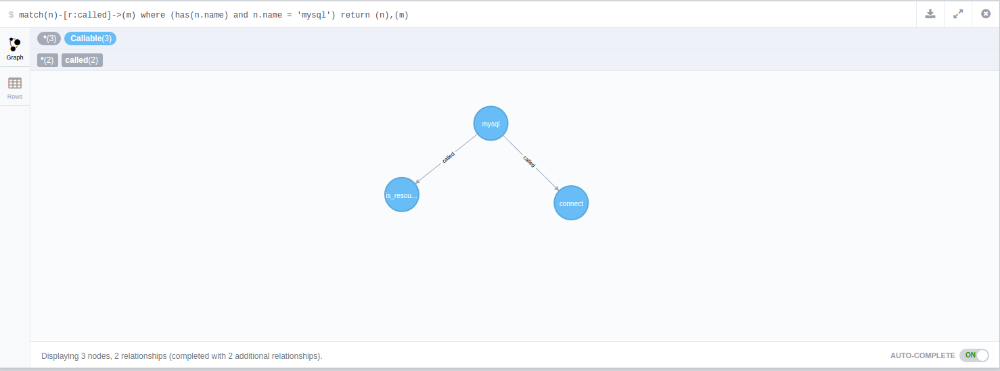

# xhprof-graph
#####XHProf + Neo4J
Parses/stores `*.xhprof` files and stores to Neo4J for reporting, tracking and analytics.
It's in a minimally-functioning/hacky state right now, and relies on importing *.xhprof files. I've
got a ways to go still, but this is the general idea.

##Why a Graph?
 * No means to aggregate data natively in Xhprof (needs something)
 * Callgraphs are graphs, so why not store the data as such? 
 * Emphasis on relationships rather than structure.
 * Maybe find some cool relationships/queries that would be otherwise difficult/very slow in RDBMSs?
 * First useful application of a Graph DB, and I want to see what happens!

##Current Setup
This is my first attempt at working with a Graph DB. I'm not sure this is the best (or even the correct) way to go about it, but it seems to work so far.
* Runs are pageviews
* Scripts are pages
* Map `script`->`run`->`ParentClass::parentMethod`->`ChildClass::childMethod`
* Functions are noted by an absence of a `class` attribute.
* Statistics are stored as relationship attributes
 

## Requirements
1. [Composer](https://getcomposer.org/)

## Setup
1. `git submodule init && git submodule update`
2. `composer install`

## Contributing
Pull requests, ideas and suggestions welcome!

github@cmattoon.com

View on a per-run basis (per-pageview).

Most expensive classes (average across all runs).

Some sample screenshots (from Neo4J)

